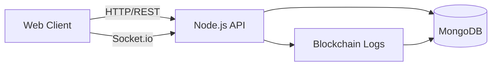

# 🎵 Distributed Concert Ticketing System (V2)

A full-stack distributed ticketing system built with Node.js, Angular, and MongoDB.

## 🚀 Key Features
- **Architecture**: Distributed system with real-time communication.
- **Database**: MongoDB with **transaction-based seat locking** to prevent double-booking.
- **Authentication**: JWT-based auth with `USER` and `ADMIN` roles.
- **QR Code System**: Automated QR generation for tickets and a validation scanner.
- **Real-time**: Instant seat status updates across all clients using Socket.io.
- **Blockchain**: Transaction logging for all ticket actions (SOLD, USED, etc.).
- **Cron Jobs**: Automatic ticket expiration after event end time.

## 🛠 Tech Stack
- **Backend**: Node.js, Express, MongoDB (Mongoose), Socket.io, JWT, Bcrypt, Node-cron.
- **Frontend**: Angular (Standalone Components), RxJS, Socket.io-client.
- **DevOps**: Docker, Docker Compose.

## 🏁 Quick Start

### 1. Start with Docker Compose
```bash
docker-compose up --build
```

### 2. Access the App
- **Frontend**: [http://localhost:4200](http://localhost:4200)
- **Backend API**: [http://localhost:3000/api](http://localhost:3000/api)

### 3. Default Credentials
- **Admin**: `admin` / `admin123`
- **User**: Register a new account on the website.

## 📖 API Reference

### Auth
- `POST /api/auth/register` - Create account
- `POST /api/auth/login` - Get JWT token

### Events (Admin Only for POST/DELETE)
- `GET /api/concerts` - List all events
- `POST /api/concerts` - Create event & auto-generate seats
- `GET /api/concerts/:id/seats` - Get seat grid with status

### Tickets
- `POST /api/tickets/buy` - Purchase a ticket (Protected)
- `POST /api/tickets/validate` - Mark ticket as USED via Scanner

### Blockchain
- `GET /api/blockchain` - View transaction logs
- `GET /api/blockchain/validate` - Verify chain integrity

## 🧪 Concurrency Testing
The system uses MongoDB transactions with conditional seat updates. If two users attempt to buy the same seat at the exact same millisecond, the second transaction is rejected because the seat status is no longer `AVAILABLE`.

## ✅ Requirements Mapping (Professor Checklist)
- **Seat selection with start/end time events**: Events have `startTime`/`endTime` and seats are generated per event.
- **Prevent write-write conflicts**: Seat purchase uses a conditional update so only one buyer can lock the seat.
- **Validate ticket at entrance**: Scanner validates ticket and checks time window; invalidates on use.
- **Invalidate after entry**: Ticket status becomes `USED` and cannot be reused.
- **Invalidate after event ends**: Cron job marks tickets as `EXPIRED`.
- **Cancel ticket**: User can cancel and ticket becomes `CANCELLED`.
- **Change ticket name**: Owner name change supported and logged.
- **Minimal web UI**: Events, seat selection, buy, my tickets, and scanner pages.
- **Real-time updates**: Socket.io pushes seat and ticket state updates.
- **Docker deployment**: All services packaged with Docker and launched with docker-compose.
- **Client-server + blockchain**: Server logs all ticket state transitions to a blockchain log.
- **Blockchain transactions**: `SOLD`, `USED`, `CANCELLED`, `NAME_CHANGE`, `EXPIRED` are stored as blocks.
- **MQTT/WebSocket equivalent**: Socket.io is used for real-time sync between clients.
- **Git repository**: Code shared via git repository.

## 🔗 Blockchain (Short Explanation)
This project uses a **private blockchain-style ledger** stored in MongoDB. Each ticket state change is written as a block with:
- `hash` of the current block
- `previous_hash` linking to the previous block
- `action` (SOLD, USED, CANCELLED, NAME_CHANGE, EXPIRED)
- timestamp + ticket metadata

Because each block contains the previous hash, the history is **tamper-evident**. This satisfies the blockchain requirement without needing a public blockchain network.

### Mermaid Diagram (Blockchain Flow)
```mermaid
flowchart TD
	A[Ticket Event: SOLD/USED/CANCELLED/EXPIRED/NAME_CHANGE] --> B[Create Block]
	B --> C[Block Hash = SHA256(index + time + data + prevHash)]
	C --> D[Store in blockchain_logs]
	D --> E[Next Block links previous_hash]
```

## 🧭 System Diagram (Architecture)


## 🎬 Demo Script (Quick Professor Demo)
1. Start services: `docker-compose up --build`
2. Open two browsers: `http://localhost:4200/events`
3. Login as admin (`admin/admin123`) and create an event with seats.
4. User A buys seat A1; User B sees seat A1 turn SOLD instantly.
5. Cancel the ticket and observe real-time seat availability.
6. Validate ticket in Scanner and see status change to USED.
7. Wait for event end or run cron to see ticket EXPIRED and blockchain updated.
8. Open admin blockchain tab to show the transaction log + charts.

## ✅ Tests
Run backend tests (double-sell and time validation):
```bash
cd backend
npm test
```
